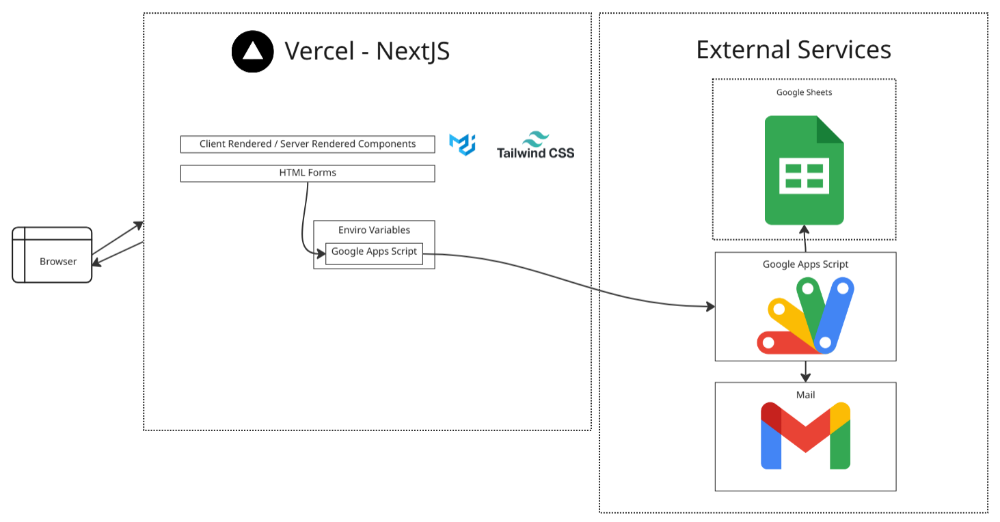

# Sky Dance Studio Website
The Sky Dance Studio website is designed to work smoothly across desktops, tablets and mobile devices. Using intuitive UI, it allows users to view classes, information and timetables from the dance studio. 

Through the integration of Google Apps Scripts, users can also directly contact the studio by submitting enquiries and expressions of interest.  

## Quick Start
Open [Sky Dance Studio](https://skydancestudio.vercel.app/) in your browser.

## Key Features
- **Home Page:** View a snapshot of the most relevant information, including links to different pages
- **About Us:** Explore the team behind Sky Dance Studio, and see our history
- **Classes:** Browse through the list of dance styles available, as well as the current timetable based on the school term.
- **Join:** Contact the studio to enrol in classes or request a trial. See a summary of the studio's contact information.
- **Contact Page**: Contac the studio about any other enquiries. See a summary of the studio's contact information.

## Architecture Overview

### Next.Js and Vercel
This is a [Next.js](https://nextjs.org) project bootstrapped with [`create-next-app`](https://github.com/vercel/next.js/tree/canary/packages/create-next-app).

This website is deployed onto Vercel. Any changes onto the main branch of this repository will trigger a redeployment.

### Google Apps Script, Sheets, Mail
This website uses [Google Apps Script](https://developers.google.com/apps-script) to automate two main tasks:
- Integrate with Google Sheets. Updates the relevant spreadsheet with customer details and their enquiry.
- Sends email to the dance studio, displaying the customer enquiry. Sends email to the customer, to notify them of their enquiry being received. 

## Future Scope
- Create Docker Image on Dockerhub of this project
- Studio Hire Page
- Allow customers to select trial date and time for the corresponding class 